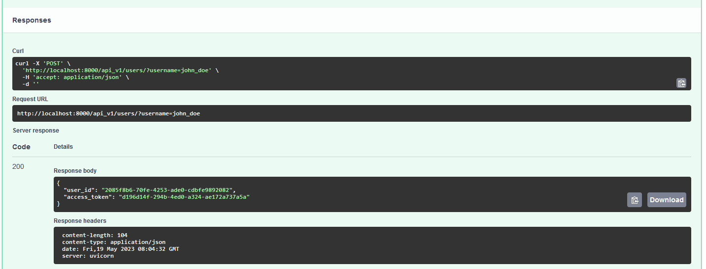
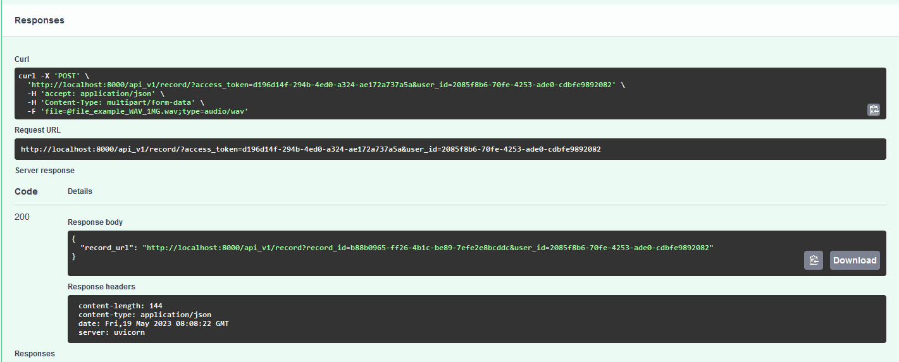
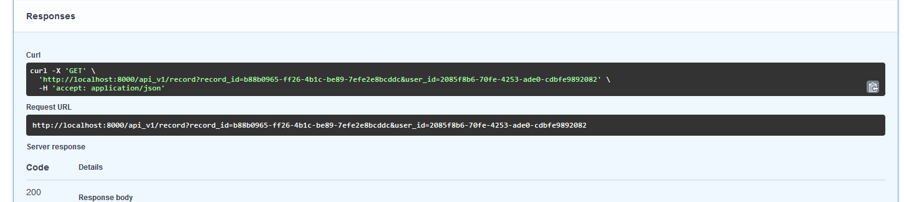

# Проект "Веб-сервис для обработки аудиозаписей"

Детализация задачи:

С помощью Docker (предпочтительно - docker-compose) развернуть образ с любой опенсорсной СУБД (предпочтительно - PostgreSQL). Предоставить все необходимые скрипты и конфигурационные (docker/compose) файлы для развертывания СУБД, а также инструкции для подключения к ней. Необходимо обеспечить сохранность данных при рестарте контейнера (то есть - использовать volume-ы для хранения файлов СУБД на хост-машине).

## Структура проекта

```
├── app
│   ├── app.py
│   ├── config.py
│   ├── models.py
│   ├── schemas.py
│   └── utils.py
│   └── api_v1
│       ├── deps.py
│       └── routers.py
│       └── endpoints
│           ├── records.py
│           └── user.py
├── db
│   ├── accessors.py
│   ├── base.py
├── main.py
├── .env
├── .flake8
├── .gitignore
├── alembic.ini
├── docker-compose.yml
├── Dockerfile
├── poetry.lock
├── pyproject.toml
├── README.md
└── requirements.txt
```

- `app`: Каталог приложения, содержащий основные модули и файлы, связанные с приложением.
  - `app.py`: Основной модуль FastAPI приложения.
  - `config.py`: Конфигурационный файл для приложения.
  - `models.py`: Модели данных, представляющие таблицы в базе данных.
  - `schemas.py`: Схемы данных, используемые для валидации запросов и ответов API.
  - `utils.py`: Вспомогательные утилиты и функции для приложения.
  - `api_v1`: Каталог API версии 1.
    - `deps.py`: Модуль с зависимостями API.
    - `routers.py`: Модуль с объединенными маршрутизаторами API.
    - `endpoints`: Каталог с модулями, содержащими обработчики конкретных конечных точек API.
      - `records.py`: Модуль с обработчиками для работы с аудиозаписями.
      - `user.py`: Модуль с обработчиками для работы с пользователями.
- `db`: Каталог для доступа к базе данных.
  - `accessors.py`: Модуль с классами доступа к данным базы данных.
  - `base.py`: Базовый класс для работы с базой данных.
- `main.py`: Основной файл запуска приложения.
- `.env`: Файл конфигурации переменных среды.
- `.flake8`: Файл конфигурации для линтера Flake8.
- `.gitignore`: Файл, указывающий, какие файлы и каталоги должны быть проигнорированы при работе с Git.
- `alembic.ini`: Файл конфигурации для Alembic, инструмента для работы с миграциями базы данных.
- `docker-compose.yml`: Файл конфигурации для Docker Compose, содержащий настройки для развертывания контейнеров и сервисов.
- `Dockerfile`: Файл Dockerfile для создания образа Docker с приложением.
- `poetry.lock`: Файл, содержащий точные версии всех зависимостей, установленных с помощью Poetry.
- `pyproject.toml`: Файл конфигурации Poetry, содержащий информацию о проекте и его зависимостях.
- `README.md`: Файл README с описанием проекта, инструкциями по установке и использованию.
- `requirements.txt`: Файл, содержащий список зависимостей Python для установки через pip.

## Предварительные требования

Убедитесь, что у вас установлены следующие зависимости:

+  Python 3.11
  +  Docker
    +  Docker Compose

## Установка и запуск

1. Убедитесь, что у вас установлен Docker и Docker Compose.
2. Склонируйте репозиторий с проектом:
   ```bash
   git clone https://github.com/your/repository.git
   ```
3. Перейдите в корневую директорию проекта:
   ```bash
   cd project-name
   ```
4. Создайте файл `.env` и настройте переменные среды в соответствии с вашей конфигурацией.
5. Запустите контейнеры с помощью Docker Compose:
   ```bash
   docker-compose up -d
   ```
   При первом запуске в контейнере с API выполнить
   ```bash
    poetry run alembic upgrade head
    ```
6. После успешного запуска контейнеров, вы сможете обращаться к веб-сервису по указанному вами порту.

### API Endpoints

#### Создание пользователя

```http
Request:

POST /api/v1/users/?username=john_doe
Content-Type: application/json
Accept: application/json

Response:

HTTP/1.1 200 OK
Content-Type: application/json

{
  "user_id": "2085f8b6-70fe-4253-ade0-cdbfe9892082",
  "access_token": "d196d14f-294b-4ed0-a324-ae172a737a5a"
}
```

#### Добавление аудиозаписи

```http
Request:

POST /api/v1/record/?access_token=d196d14f-294b-4ed0-a324-ae172a737a5a&user_id=2085f8b6-70fe-4253-ade0-cdbfe9892082
Content-Type: multipart/form-data
Accept: application/json

file=@file_example_WAV_1MG.wav;type=audio/wav

Response:

HTTP/1.1 200 OK
Content-Type: application/json

{
  "record_url": "http://localhost:8000/api_v1/record?record_id=b88b0965-ff26-4b1c-be89-7efe2e8bcddc&user_id=2085f8b6-70fe-4253-ade0-cdbfe9892082"
}
```

#### Доступ к аудиозаписи

```http
Request:

GET /api/v1/record?record_id=b88b0965-ff26-4b1c-be89-7efe2e8bcddc&user_id=2085f8b6-70fe-4253-ade0-cdbfe9892082
Accept: application/json

Response:

HTTP/1.1 200 OK
Content-Type: application/json

{
  "record_url": "http://localhost:8000/api_v1/record?record_id=b88b0965-ff26-4b1c-be89-7efe2e8bcddc&user_id=2085f8b6-70fe-4253-ade0-cdbfe9892082"
}
```

## Схема базы данных

Для проекта используется SQLAlchemy и PostgreSQL для определения следующей схемы базы данных:

### Таблица `users`
- `id_` (UUID, первичный ключ): Уникальный идентификатор пользователя.
- `username` (Строка): Имя пользователя.
- `access_token` (UUID): Токен доступа для пользователя.

### Таблица `records`
- `id_` (Целое число, первичный ключ): Уникальный идентификатор записи.
- `user_id` (UUID, внешний ключ): Внешний ключ, ссылается на столбец `id_` таблицы `users`. Представляет пользователя, связанного с записью.
- `record_id` (UUID): Уникальный идентификатор записи.
- `title` (Строка, допускается значение NULL): Заголовок записи.
- `user` (Отношение к модели `UserModel`): Отношение к модели `UserModel`, представляющее пользователя, связанного с записью.

## Зависимости
Зависимости проекта управляются с помощью Poetry. Файл pyproject.toml содержит список зависимостей.
Дополнительная информация

Документация FastAPI: https://fastapi.tiangolo.com/
Документация SQLAlchemy: https://docs.sqlalchemy.org/

### Примеры работы

#### Создание пользователя 
```http 
curl -X 'POST'
    'http://localhost:8000/api_v1/users/?username=john_doe'
    -H 'accept: application/json'
    -d ''
    
Response 
```


### Добавление аудиозаписи 
```http 

curl -X 'POST'
    'http://localhost:8000/api_v1/record/?access_token=d196d14f-294b-4ed0-a324-ae172a737a5a&user_id=2085f8b6-70fe-4253-ade0-cdbfe9892082'
    -H 'accept: application/json'
    -H 'Content-Type: multipart/form-data'
    -F 'file=@file_example_WAV_1MG.wav;type=audio/wav' 

Response
``` 


### Доступ к аудиозаписи 
```http 
curl -X 'GET'
    'http://localhost:8000/api_v1/record?record_id=b88b0965-ff26-4b1c-be89-7efe2e8bcddc&user_id=2085f8b6-70fe-4253-ade0-cdbfe9892082'
    -H 'accept: application/json' 
Response
```

